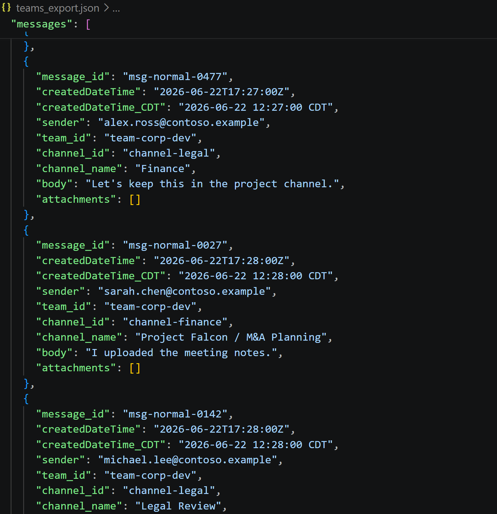
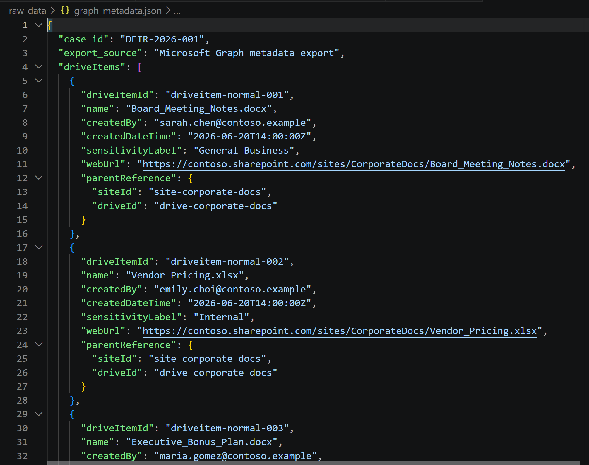
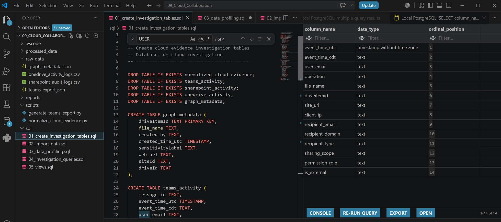
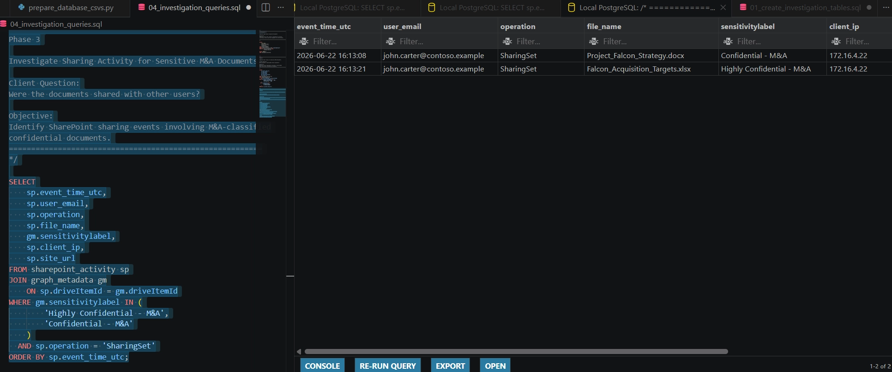
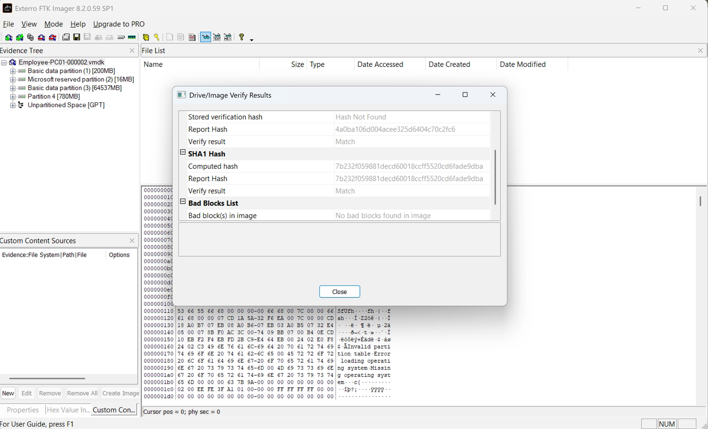
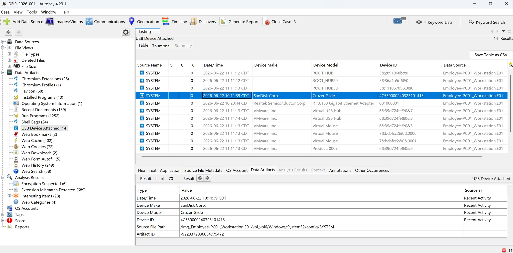
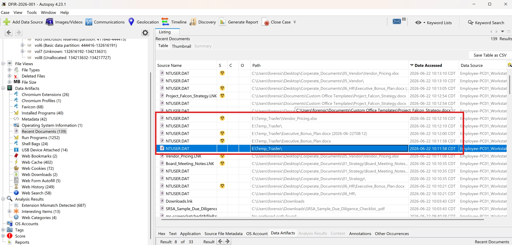
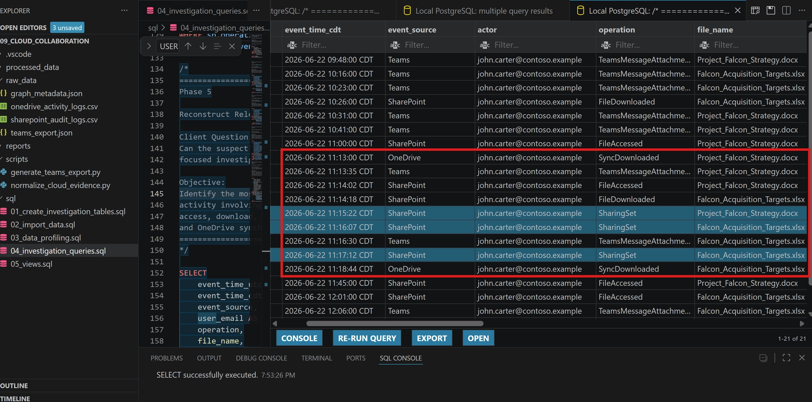

# Enterprise Insider Threat Investigation

> Advanced Digital Forensics & Cloud Investigation Project using **FTK
> Imager, Autopsy, Python, PostgreSQL, and Microsoft 365 Audit Logs** to
> investigate suspected insider data exfiltration.


 


------------------------------------------------------------------------

📄 Complete Investigation Report

This GitHub repository focuses on the technical implementation of the investigation.

For the complete forensic investigation report—including endpoint analysis, Microsoft 365 cloud investigation, evidence interpretation, investigation timeline, Power BI dashboard, and executive findings—please visit the accompanying Notion portfolio.

🔗 View the Complete Investigation Report

https://app.notion.com/p/Enterprise-Insider-Threat-Investigation-38273d22121f80c980c4ef077d9ff3cb?source=copy_link

------------------------------------------------

# Executive Summary

A simulated enterprise insider threat investigation was conducted to
determine whether a departing employee accessed, collected, and
attempted to exfiltrate confidential corporate information.

The investigation combines endpoint forensic artifacts, Microsoft 365
cloud evidence, Python-based evidence normalization, PostgreSQL, and
SQL-driven analysis to reconstruct user activity across multiple
evidence sources.

The workflow follows a defensible DFIR methodology similar to those used
during enterprise digital forensic and incident response engagements.

------------------------------------------------------------------------

# Investigation Objectives

-   Determine whether confidential corporate documents were accessed.
-   Identify file downloads, synchronization, and sharing activity.
-   Correlate Microsoft Teams, SharePoint, OneDrive, and Graph evidence.
-   Reconstruct a unified investigation timeline.
-   Demonstrate an end-to-end DFIR investigation workflow.

------------------------------------------------------------------------

# Key Findings

-   Microsoft Teams conversations referenced confidential project
    material.
-   Cloud audit logs confirmed access to sensitive files.
-   OneDrive synchronization activity was identified.
-   SQL correlation reconstructed user activity across cloud services.
-   Endpoint artifacts confirmed USB removable media usage.
-   Combined evidence supports a simulated insider threat investigation.

------------------------------------------------------------------------

# Project Overview

This project simulates a real-world enterprise insider threat
investigation involving both endpoint forensic artifacts and Microsoft
365 cloud collaboration evidence.

Rather than analyzing isolated artifacts, the project demonstrates a
complete investigation workflow from evidence acquisition and
normalization through SQL analysis and investigative reporting.

------------------------------------------------------------------------

# Investigation Scenario

A departing employee was suspected of accessing confidential corporate
documents before leaving the organization.

The investigation focused on determining whether the employee:

-   Accessed sensitive project files
-   Downloaded confidential documents
-   Shared files through Microsoft Teams
-   Synchronized data to OneDrive
-   Shared information externally
-   Attempted to conceal evidence

------------------------------------------------------------------------

## Evidence Sources

| Source | Purpose |
|---------|----------|
| Microsoft Teams Export | Messages, attachments, collaboration activity |
| SharePoint Audit Logs | File access, downloads, sharing events |
| OneDrive Activity Logs | Synchronization activity |
| Microsoft Graph Metadata | File metadata, ownership, sensitivity labels |

------------------------------------------------------------------------

# Investigation Workflow

``` text
Raw Microsoft 365 Evidence
        │
        ▼
Python Evidence Normalization
        │
        ▼
Normalized CSV Evidence
        │
        ▼
PostgreSQL Database
        │
        ▼
SQL Investigation Queries
        │
        ▼
Investigation Findings & Reporting
```

------------------------------------------------------------------------

# Investigation Walkthrough

## 1. Raw Microsoft Teams Evidence



------------------------------------------------------------------------

## 2. Evidence Normalization



------------------------------------------------------------------------

## 3. Database Design



------------------------------------------------------------------------

## 4. SQL Investigation



------------------------------------------------------------------------

## 5. Evidence Integrity Verification



------------------------------------------------------------------------

## 6. Endpoint Artifact Analysis



------------------------------------------------------------------------

## 7. USB Artifact Analysis



------------------------------------------------------------------------

## 8. Investigation Timeline



------------------------------------------------------------------------

# Project Structure

``` text
Enterprise-Insider-Threat-Investigation
├── raw_data/
├── processed_data/
├── screenshots/
├── scripts/
├── sql/
└── README.md
```

------------------------------------------------------------------------

# Investigation Questions

-   Which sensitive files were accessed?
-   Were files downloaded or synchronized?
-   Was Microsoft Teams used to share confidential information?
-   Can cloud evidence be correlated into a unified timeline?

------------------------------------------------------------------------

# Technologies Used

## Digital Forensics

-   FTK Imager
-   Autopsy

## Programming

-   Python
-   JSON
-   CSV

## Database

-   PostgreSQL
-   SQL

## Cloud

-   Microsoft 365
-   Microsoft Teams
-   SharePoint
-   OneDrive
-   Microsoft Graph

------------------------------------------------------------------------

# Skills Demonstrated

-   Digital Forensic Investigation
-   Insider Threat Investigation
-   Microsoft 365 Cloud Evidence Analysis
-   Evidence Normalization
-   SQL Investigation
-   Timeline Reconstruction
-   Python Automation
-   PostgreSQL Database Design
-   FTK Imager Evidence Validation
-   Autopsy Artifact Analysis
-   Investigative Reporting

------------------------------------------------------------------------

# Future Improvements

-   Microsoft Purview Audit Logs
-   Exchange Online Investigation
-   Azure AD Sign-in Analysis
-   Timeline Visualization
-   Power BI Investigation Dashboard

------------------------------------------------------------------------

# Author

**Jaemin You**

Digital Forensics \| Incident Response \| SQL \| Python \| Microsoft 365

